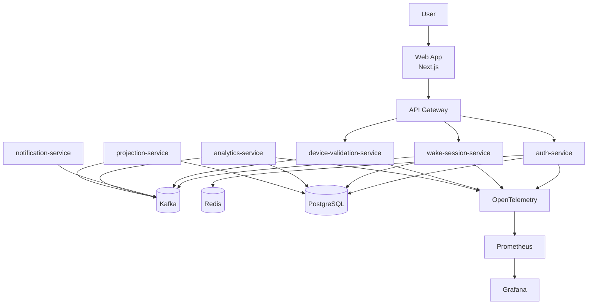
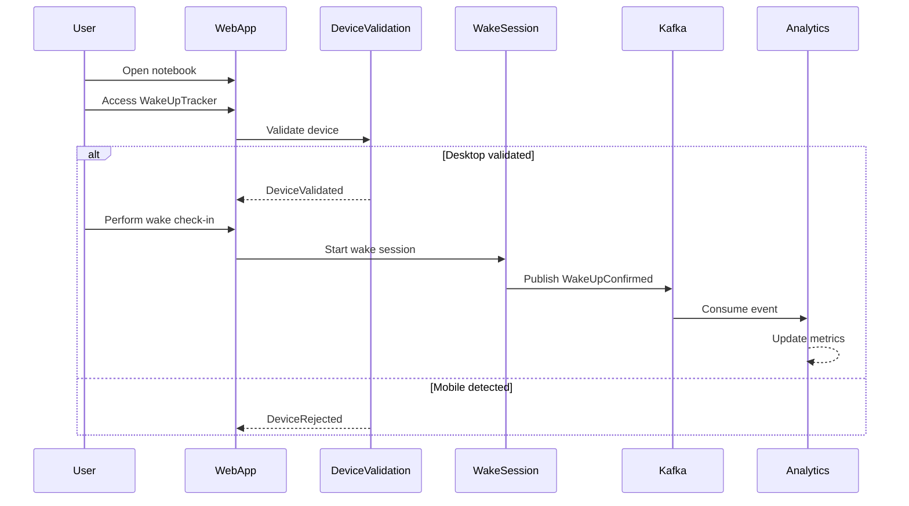

# ⏰ WakeUpTracker — Event-Driven Wake-Up Accountability Platform

WakeUpTracker is an event-driven platform designed to help remote workers build consistency in their morning routines and maintain accountability for waking up on time.

The system is NOT intended to be just another alarm clock application.

The core idea is to validate that the user:
- actually got out of bed
- turned on their notebook
- accessed the web application
- started their productivity routine

The platform combines:
- wake-up tracking
- behavioral consistency analytics
- distributed workflows
- event-driven architecture
- observability
- modern backend engineering

---

# 🎯 Main Goal

The objective of this project is twofold:

1. Solve a real-world behavioral problem:
   - difficulty waking up early
   - inconsistent work routine
   - lack of accountability in home office environments

2. Demonstrate senior-level software engineering skills:
   - Event-Driven Architecture
   - Clean Architecture
   - Hexagonal Architecture
   - CQRS
   - distributed systems
   - observability
   - asynchronous workflows
   - backend engineering in Golang

---

# 🧠 Core Concept — Wake Session

WakeUpTracker introduces the concept of a **Wake Session**.

The user does NOT simply disable an alarm.

The system validates that the user:
- opened their notebook
- accessed the web platform
- completed a wake-up check-in
- initiated real activity

A Wake Session represents:
- the beginning of the user’s workday
- confirmation of wake-up
- activation of productivity mode

---

# 🏗️ High-Level Architecture



---

# MVP Implementation

This repository now contains a working MVP scaffold with independent backend services, a desktop-only web app, and local observability infrastructure.

## Services

| Service | Port | Responsibility |
| --- | ---: | --- |
| auth-service | 8081 | Login, session creation, auth events |
| wake-session-service | 8082 | Wake check-in, Morning Intent, streaks, success/failure |
| device-validation-service | 8083 | Desktop/notebook validation and mobile/tablet rejection |
| notification-service | 8084 | Notification dispatch model and NotificationSent events |
| analytics-service | 8085 | Behavioral consistency metrics and regression detection |
| projection-service | 8086 | CQRS dashboard/timeline projection endpoints |
| web-app | 3000 | Login, dashboard, wake check-in, Morning Intent form |

Every backend service follows:

```text
cmd/
internal/domain
internal/application
internal/ports
internal/adapters/inbound
internal/adapters/outbound
internal/infrastructure
```

## Morning Intent Rule

The Wake Session domain enforces the MVP rule directly:

- desktop device proof is required
- Morning Intent is required
- Morning Intent must be meaningful
- wake-up confirmation happens only after Morning Intent submission
- check-in outside the 10-minute tolerance window creates a failed wake-up and breaks streak

The emitted event order is:

```text
WakeSessionStarted
MorningIntentSubmitted
WakeUpConfirmed | WakeUpFailed
StreakIncreased | StreakBroken
```

## Local Development

Run backend tests:

```bash
cd backend
GOCACHE=../.gocache GOMODCACHE=../.gomodcache go test ./...
```

Run a single service:

```bash
cd backend
go run ./services/wake-session-service/cmd
```

Run the frontend:

```bash
cd frontend/web-app
npm install
npm run dev
```

Run the full infrastructure:

```bash
cd infra
docker compose up --build
```

## Observability

All Go services expose:

```text
GET /health
GET /metrics
```

Prometheus scrapes all services from `infra/prometheus/prometheus.yml`, and Grafana is provisioned with a WakeUpTracker dashboard.

## Event Contract

All domain events use:

```json
{
  "event_id": "uuid",
  "event_type": "string",
  "aggregate_id": "string",
  "correlation_id": "uuid",
  "payload": {},
  "created_at": "timestamp"
}
```

The current code includes local in-memory outbound adapters so the architecture compiles and can be exercised immediately. Wake check-in idempotency also has a Redis adapter enabled by `REDIS_ADDR`. Kafka and Postgres are present in Docker Compose and should be wired behind the existing ports without changing domain/application code.

---

# 🏗️ Architecture Principles

- Event-Driven Architecture (EDA)
- Clean Architecture
- Hexagonal Architecture
- CQRS projections
- Asynchronous communication via Kafka
- Distributed workflows
- Event traceability
- Idempotent consumers
- Structured logging
- Full observability
- Rich domain modeling

---

# 🏗️ Monorepo Structure

```text
/wakeup-tracker
├── backend/
│   ├── services/
│   │   ├── auth-service/
│   │   ├── wake-session-service/
│   │   ├── notification-service/
│   │   ├── analytics-service/
│   │   ├── device-validation-service/
│   │   └── projection-service/
│   │
│   └── shared/
│       ├── events/
│       ├── contracts/
│       ├── infra/
│       └── observability/
│
├── frontend/
│   └── web-app/
│
├── infra/
│   ├── docker-compose.yml
│   ├── kafka/
│   ├── postgres/
│   ├── redis/
│   ├── prometheus/
│   ├── grafana/
│   └── otel/
│
└── README.md
```

---

# ⚙️ Tech Stack

## Backend

- Golang
- PostgreSQL
- Redis
- Apache Kafka

## Frontend

- Next.js
- React
- TypeScript
- TailwindCSS

## Observability

- Prometheus
- Grafana
- OpenTelemetry

---

# 🧱 Backend Architecture Pattern

Every backend service follows:

## Clean Architecture + Hexagonal Architecture

Required structure:

```text
cmd/
internal/domain
internal/application
internal/ports
internal/adapters/inbound
internal/adapters/outbound
internal/infrastructure
```

---

# 🧩 Wake Session Flow


